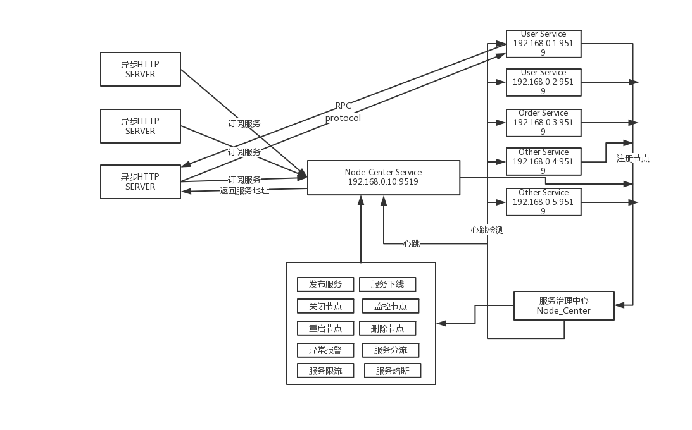

# Group-Co	

#### 为什么写这个框架？
- 利用协程特性以同步方式来编写异步代码，增强可读性。
- 将swoole的异步特性与传统框架的MVC相结合。
- 可以用作api也可以用作http server。

#### * 异步协程调度，应对高并发
#### * SOA服务化调用，支持并行、串行调用。服务端采用AsyncTask进行异步处理后合并数据并返回。
#### * 支持异步日志,异步文件读写,异步Mysql,异步Redis
#### * 支持Mysql连接池,Redis连接池
#### * Mysql事务处理
#### * Twig、Doctrine支持视图、服务数据层
#### * 单元测试覆盖

##### 环境依赖
- hiredis
- redis
- mysql
- php5.6
- swoole >=1.9.15 (在编译swoole时加入--enable-async-redis，开启异步redis客户端)

##### 安装(请先完成环境依赖安装)
- 克隆项目
- 执行 => composer install
- 新建一个runtime目录，用于存放日志等cache文件
- 启动http server => php server.php
- 访问 http://localhost:9777/ 开始异步协程之旅
- demo 查看，请继续一下步骤，将用nginx做一次反向代理资源文件
- 修改配置nginx，见doc/nginx.md,配置hosts
- 配置config中的service,database等配置文件
- 执行脚本 => app/console sql:migrate 
- 启动node_center服务 => app/service node_center (注意修改config/service.php中的node_center)
- 启动user服务 => app/service user
- 还可以启动其他服务，自行配置
- 查看节点信息 => groupco.com/admin，上线User服务
- 访问配置的servername => groupco.com/demo 即可

##### 不使用服务中心
- 将config/service.php中的node_center地址设为空
- 将config/app.php中swoole_process选项的'src\Admin\Process\HeartbeatProcess'注释
- 将无法使用service_center()方法获取服务模块，只能使用service直接调用

##### 使用
- 热重启httpserver => php server.php -s reload
- 关闭httpserver => php server.php -s stop
- 热重启某个服务 => app/service user reload
- 关闭某个服务 => app/service user stop

##### 要注意的点
- 1.因为是异步的，无法设置swoole的max_request参数。
- 2.内存释放的问题，局部静态变量，全局变量的释放。

##### 基础服务
- AsyncMysql
- AsyncRedis
- AsyncService
- AsyncLog
- AsyncFile
- Container
- Controller
- Config
- Event
- Route
- Request
- Response
- StaticCache
- Sync
  - Container
  - Console
  - FileCache
  - RedisCache
  - StaticCache
  - Log
  - Dao
  - Service
- Test

#### 常用特性使用

##### 串行调用(不使用服务中心)

```php
    
    $start = microtime(true);
    //设置2秒超时
    service("user")->setTimeout(2);
    $users = (yield service("user")->call("User\User::getUsersCache", ['ids' => [1, 2, 3, 4, 5, 6, 7, 8, 9, 10]]));
    dump($users);

```

##### 串行调用(使用服务中心)

```php
    
    $start = microtime(true);
    //设置2秒超时
    $service = (yield service_center("User"));
    $service->setTimeout(2);
    $users = (yield $service->call("User::getUsersCache", ['ids' => [1, 2, 3, 4, 5, 6, 7, 8, 9, 10]]));
    dump($users);

```

##### 并行调用(不使用服务中心)

```php

    $start = microtime(true);
    //设置2秒超时
    service("user")->setTimeout(2);

    $callId1 = service("user")->addCall("User\User::getUsersCache", ['ids' => [1, 2, 3, 4, 5, 6, 7, 8, 9, 10]]);
    $callId2 = service("user")->addCall("User\User::getUser", ['id' => 1]);
    $res = (yield service("user")->multiCall());

    dump($res[$callId1]);
    dump($res[$callId2]);
    dump(microtime(true) - $start);
    
```

##### 并行调用(使用服务中心)

```php

    $start = microtime(true);
    //设置2秒超时
    $service = (yield service_center("User"));
    $service->setTimeout(2);

    $callId1 = $service->addCall("User::getUsersCache", ['ids' => [1, 2, 3, 4, 5, 6, 7, 8, 9, 10]]);
    $callId2 = $service->addCall("User::getUser", ['id' => 1]);
    $res = (yield $service->multiCall());

    dump($res[$callId1]);
    dump($res[$callId2]);
    dump(microtime(true) - $start);
    
```

##### 异步redis(默认使用连接池)

```php
    
    use AsyncRedis;

    //关闭连接池
    \AsyncRedis::enablePool(false);
    //开启连接池
    \AsyncRedis::enablePool(true);
    //设置超时时间
    AsyncRedis::setTimeout(2);

    yield AsyncRedis::set('foo', 'bar');
    dump(yield AsyncRedis::get('foo'));
    $user = json_encode(['foo' => 'bar']);
    yield AsyncRedis::hSet('user', 1, $user);
    dump(yield AsyncRedis::hGet('user', 1));
    
```

##### 异步mysql(默认使用连接池)

```php
    
    use AsyncMysql;
    
    //第二个参数设为false将不会使用连接池中的资源，默认都会从连接池中取，配置连接池数量 => config/database.php
    AsyncMysql::query($sql, $usePool = true);

    //设置超时时间
    AsyncMysql::setTimeout(2);

    $res = (yield AsyncMysql::query("INSERT INTO `user` (`id`, `mobile`, `password`) VALUES (NULL, '18768122222', '11111')"));
    //失败返回false   
    if ($res) {
        $result = $res->getResult();
        $affectedRows = $res->getAffectedRows();
        $id = $res->getInsertId();
    }
    
```

##### 异步mysql事务处理

```php
    
    use AsyncMysql;
    
    public function test()
    {
        try {
            yield AsyncMysql::begin();

            $res = (yield $this->doTrans());
            if ($res === false) {
                throw new \Exception("need roll back");
            }

            yield AsyncMysql::commit();
        } catch (\Exception $e) {
            yield AsyncMysql::rollback();
        }
    }

    public function doTrans()
    {
        $res = (yield AsyncMysql::query("INSERT INTO `user` (`id`, `mobile`, `password`) VALUES (NULL, '187681343332', '11111')"));
        if ($res) {
            $result = $res->getResult();
            $affectedRows = $res->getAffectedRows();
            $id = $res->getInsertId();
            $res = (yield AsyncMysql::query("SELECT * FROM `user` WHERE id = {$id}"));
            $res = (yield AsyncMysql::query("SELECT * FROM `user`"));
            $res = (yield AsyncMysql::query("DELETE FROM `user` WHERE id = {$id}", false));
        }

        yield true;
    }
```

##### 异步Log

```php
    
    use AsyncLog;

    yield AsyncLog::info('hello world');

    yield AsyncLog::debug('test debug', ['foo' => 'bar']);

    yield AsyncLog::notice('hello world',[], 'group.com');

    yield AsyncLog::warning('hello world');

    yield AsyncLog::error('hello world');

    yield AsyncLog::critical('hello world');

    yield AsyncLog::alert('hello world');

    yield AsyncLog::emergency('hello world');
    
```


##### 异步文件读写

```php
    
    use AsyncFile;

    $content = (yield AsyncFile::read(__ROOT__."runtime/test.txt"));

    $res = (yield AsyncFile::write(__ROOT__."runtime/test.txt", "hello wordls!"));

    $res = (yield AsyncFile::write(__ROOT__."runtime/test.txt", "hello wordls!", FILE_APPEND));

```

##### 异常处理

```php
    
    //如果在业务层不catch，框架层会捕捉，并返回一个500的server error响应。如果在开发环境会返回一个500的具体错误的trace响应。
    try {
        throw new \Exception("Error Processing Request", 1); 
        //yield throwException(new \Exception("Error Processing Request", 1));
    } catch (\Exception $e) {
        echo  $e->getMessage();
    }

```

##### 服务治理示意图



##### License MIT
##### 感谢Swoole